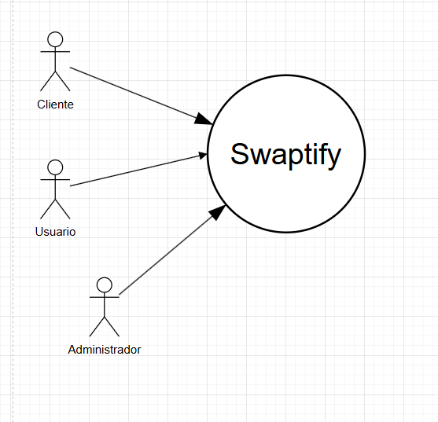

# Documentación Swaptify

## Arquitectura basada en Microservicios

El sistema Swaptify está construido sobre una arquitectura de microservicios, cada uno responsable de un dominio específico del negocio. Los microservicios principales son:

- **Usuarios**: Gestión de usuarios, autenticación, autorización, perfiles y administración.
- **Productos**: Gestión del catálogo de productos, filtrado, búsqueda y administración de inventario.
- **Compras**: Manejo de órdenes de compra, historial y carrito de compras.
- **Pagos**: Procesamiento de pagos y métodos asociados.
- **Devoluciones**: Gestión de devoluciones de productos.
- **Favoritos**: Administración de productos favoritos de los usuarios.
- **Chatbot**: Asistente conversacional para consultas rápidas y automatización de soporte.

Cada microservicio expone su propia API REST y puede ser desplegado de forma independiente en un entorno de Kubernetes.

## Especificación de Requisitos
### Requisitos funcionales

| No requerimiento | Nombre del Requisito                       | Descripción                                                                                                 | Actor       | Medio  |
| ---              | ---                                        | ---                                                                                                         | ---         | ---    |
| RF-01            | Visualizar catálogo productos              | El usuario tanto logeado como no logeado puede tener acceso a la vista de los productos que tiene el portal |Usuario      |Pantalla|
| RF-02            | Filtrar productos                          | El usuario podrá filtrar los productos ya sea por categoría, precio, región, etc.                          |Usuario      |Pantalla|
| RF-03            | Búsqueda de productos                      | El usuario podrá buscar los productos que necesite                                                          |Usuario      |Pantalla|
| RF-04            | Medios de pago                             | El usuario podrá usar diferentes medios de pago (tarjeta de débito/crédito)                                 |Usuario      |Pantalla|
| RF-05            | Inicio de sesión                           | El usuario podrá iniciar sesión en su cuenta para poder comprar sus productos                               |Usuario      |Pantalla|
| RF-06            | Carrito de compras                         | El usuario podrá agregar al carrito de compras los productos a comprar                                      |Usuario      |Pantalla|
| RF-07            | Descuentos y promociones                   | El usuario podrá tener descuentos o promociones                                                             |Usuario      |Pantalla|
| RF-08            | Agregar productos a favoritos              | El usuario podrá agregar a los productos que le gusten en el apartado de favoritos                          |Usuario      |Pantalla|
| RF-09            | Ver historial de compras                   | El usuario podrá ver todas las compras que ha realizado a lo largo del tiempo                               |Usuario      |Pantalla|
| RF-10            | Devolución de productos                    | El usuario en caso de no estar satisfecho con los productos, podrá pedir una devolución                     |Usuario      |Pantalla|
| RF-11            | Modificar datos del usuario                | El usuario podrá modificar su información                                                                   |Usuario      |Pantalla|
| RF-12            | Registro y autorización de usuarios        | El usuario podrá crear una cuenta para poder comprar en el portal                                           |Usuario      |Pantalla|
| RF-13            | Asistente conversacional                   | El usuario podrá interactuar con un chatbot para consultas rápidas y soporte                                |Usuario      |Pantalla|
| RF-14            | Habilitación y Deshabilitación de cuentas  | El usuario administrador podrá habilitar y deshabilitar las cuentas de los usuarios                         |Administrador|Pantalla|
| RF-15            | Administración de promociones y descuentos | El usuario administrador podrá crear o quitar promociones y descuentos a los usuarios                       |Administrador|Pantalla|
| RF-16            | Seguimiento de usuarios                    | El usuario administrador podrá ver todos los usuarios reportados o con incidencias                          |Administrador|Pantalla|
| RF-17            | Gestión de productos                       | El usuario administrador podrá agregar, modificar y eliminar productos                                      |Administrador|Pantalla|

### Requisitos no funcionales

| No requerimiento  | Nombre del Requisito  | Descripción | Actor | Medio |
| ---               | ---                   | ---         | ---   | ---   |
| RNF-01            | Escalabilidad y rendimiento |El sistema debe ser capaz de manejar un alto volumen de usuarios simultáneos y productos sin degradar el rendimiento|Sistema|Sistema|
| RNF-02            | Seguridad             |El sistema debe implementar mecanismos de autenticación y autorización robustos (JWT, OAuth2, etc.)|Sistema|Sistema|
| RNF-03            | Disponibilidad y fiabilidad |El sistema debe tener un tiempo de disponibilidad mínimo del 99.9%|Sistema|Sistema|
| RNF-04            | Usabilidad |El sistema debe ser intuitivo, fácil de usar y accesible para todos los usuarios|Usuario|Pantalla|
| RNF-05            | Mantenimiento y soporte |El sistema debe contar con documentación técnica para facilitar su mantenimiento y futuras actualizaciones|Administrador|Sistema|
| RNF-06            | Respaldo de datos |El sistema debe tener mecanismos de respaldo de datos para evitar la pérdida de información|Sistema|Sistema|
| RNF-07            | Cumplimiento de normativas ISO |El sistema debe cumplir con las normativas ISO aceptables para mayor presentación|Sistema|Sistema|

## Microservicios y Endpoints Principales

- **Usuarios**: Registro, inicio de sesión, modificación de datos, administración de usuarios, gestión de roles, quejas y descuentos.
- **Productos**: CRUD de productos, filtrado, búsqueda, gestión de regiones y promociones.
- **Compras**: Crear orden, ver historial, actualizar carrito.
- **Pagos**: Registrar pagos, consultar pagos por usuario y por administrador.
- **Devoluciones**: Solicitar devoluciones, consultar estado.
- **Favoritos**: Agregar/quitar favoritos, notificaciones de cambios en productos.
- **Chatbot**: Consultas automáticas sobre productos, pedidos y devoluciones.

Cada microservicio cuenta con su propio archivo de rutas y documentación técnica interna.

## Despliegue y Orquestación

El sistema está preparado para despliegue en Kubernetes, con manifiestos para cada microservicio, configuración, secretos y reglas de ingreso (ingress). Las imágenes de cada microservicio se publican en un registry de contenedores y se actualizan automáticamente en los clusters de desarrollo y producción.

## Diagramas de Secuencia

- Login
  
- Registro Usuario
  
- Modificar Información Usuario
  
- Modificar Estado Activo/Desactivado Usuario
  
- Agregar Promociones
  
- Agregar Productos
  
- Generación de Descuentos
  
- Historial de Compras
  
- Agregar Producto a Favoritos
  
- Devoluciones
  

## Diagrama de Bases de Datos

* Microservicio Usuarios


* Microservicio Productos


* Microservicio Chatbot


* Microservicio Compras


* Microservicio Devoluciones


* Microservicio Favoritos


* Microservicio Pagos


## Diagrama de Arquitectura

* Diagrama de Arquitectura de Servicios


## Metodología Ágil utilizada

### Explicación de la Metodología Ágil (Jira)

Se va a utilizar como metodología ágil para el desarrollo de la aplicación Scrum, ya que es un marco de trabajo iterativo e incremental, el cual se enfoca en la entrega continua de valor al cliente, y permite adaptarse rápidaemte a cambios, fomentando la colaboración en equipos.

Los objetivos que tiene son:
 
* Entrega de una aplicación funcional y de buena calidad en iteraciones cortas conocidas como Sprints.</br>
* Priorizar funcionalidades valiosas para el cliente.</br>
* Fomentar la colaboración y transparencia entre miembros del equipo.</br>
* Adaptación rápida a cambios en requisitos o en el mercado.</br>

#### Principios de la Metodología Ágil

Se tienen los principios del Manifiesto Agil entre los que destacan dichos principios:

* Satisfacer al cliente mediante la entrega temprana y continua de software funcional.</br>
* Aceptar cambios en los requisitos, incluso en etapas tardías del desarrollo.</br>
* Entregar software funcional frecuentemente, con ciclos cortos (Sprints).</br>
* Trabajar en equipo de manera colaborativa y autoorganizada.</br>
* Reflexionar y ajustar el proceso continuamente para mejorar la eficiencia.</br>

#### Roles en Scrum

* Product Owner (PO):</br>
    * Responsable de maximizar el valor del producto.</br>
    * Define y prioriza el Product Backlog (lista de requisitos y funcionalidades).</br>
    * Asegura que el equipo entienda los requisitos y criterios de aceptación.</br>
* Scrum Master (SM):</br>
    * Facilita el proceso Scrum y elimina obstáculos.</br>
    * Asegura que el equipo siga las prácticas y principios ágiles.</br>
    * Protege al equipo de distracciones externas.</br>
* Equipo de Desarrollo:</br>
    * Encargado de diseñar, desarrollar, probar y entregar las funcionalidades.</br>
    * Autoorganizado y multidisciplinario (desarrolladores, diseñadores, testers, etc.).</br>

#### Artefactos de Scrum
* Product Backlog:</br>
    * Lista priorizada de requisitos, historias de usuario y tareas para la aplicación web.</br>
    * Ejemplo: "Como usuario, quiero registrarme en la aplicación para poder realizar compras".</br>
* Sprint Backlog:</br>
    * Conjunto de tareas seleccionadas del Product Backlog para ser completadas en un Sprint.
* Incremento:</br>
    * Versión funcional del producto al final de cada Sprint.</br>
    * Debe ser potencialmente desplegable.</br>

#### Eventos de Scrum
* Sprint Planning (Planificación del Sprint):</br>
    * Reunión al inicio de cada Sprint para seleccionar las tareas del Product Backlog y definir el objetivo del Sprint.</br>
* Daily Standup (Reunión Diaria):</br>
    * Reunión diaria de 15 minutos para sincronizar al equipo y revisar el progreso.</br>
* Sprint Review (Revisión del Sprint):</br>
    * Reunión al final del Sprint para mostrar el incremento completado al Product Owner y otros stakeholders.</br>
* Sprint Retrospective (Retrospectiva del Sprint):</br>
    * Reunión para reflexionar sobre el Sprint y proponer mejoras para el siguiente.</br>

#### Herramientas a Utilizar
* Jira: Para gestionar el Product Backlog, Sprint Backlog, tareas y reportes.</br>
* Confluence: Para documentar requisitos, decisiones técnicas y notas de reuniones.</br>
* Herramientas de desarrollo: Git (control de versiones), Jenkins (integración continua), etc.</br>

#### Ciclo de Trabajo en Scrum
* Planificación del Producto:</br>
    * El Product Owner define y prioriza el Product Backlog.</br>
* Planificación del Sprint:</br>
    * El equipo selecciona las tareas para el Sprint y define el Sprint Goal.</br>
* Ejecución del Sprint:</br>
    * El equipo trabaja en las tareas del Sprint Backlog.</br>
    * Se realizan Daily Standups para revisar el progreso.</br>
* Revisión y Retrospectiva:</br>
    * Al final del Sprint, se muestra el incremento y se reflexiona sobre el proceso.</br>
* Entrega Incremental:</br>
    * Se entrega una versión funcional de la aplicación al final de cada Sprint.</br>

### Planificación (Backlog)


### División de Tareas (Sprint)
Se dividieron las tareas en el transcurso de lo que serían las 2 semanas para temrinar la aplicación, contaron con 1 semana por cada sprint


### Pruebas de Avance


### Sprint 8/4 - 15/4


#### Sprint Planning

En la reunión de planificación del sprint, el equipo dedicó una semana a avanzar lo más posible en el desarrollo de funcionalidades clave. Se estableció un objetivo claro para el sprint (Sprint Goal) y se seleccionaron las tareas prioritarias del Product Backlog para incluirlas en el Sprint Backlog. Este enfoque permitió al equipo concentrarse en entregar valor de manera eficiente durante el sprint. 

#### Sprint Retrospective

Al finalizar el sprint, se realizó la retrospectiva, donde el equipo reflexionó sobre el proceso de trabajo. Se abordaron temas de comunicación, implementación y ajustes necesarios en los desarrollos existentes. Esta sesión proporcionó una oportunidad para identificar mejoras y planificar acciones que aumenten la calidad y eficacia en futuros sprints.

#### Funcionalidades Desarrolladas

Durante este sprint, se trabajó en las siguientes funcionalidades:​

* Productos: Implementación de la funcionalidad para agregar productos al carrito de compras.​</br>
* Favoritos: Desarrollo de la opción para que los usuarios puedan marcar productos como favoritos.​</br>
* Pagos: Integración del sistema de pagos para facilitar las transacciones dentro de la aplicación.</br>

### Sprint 10/4 - 17/4


​Durante el último sprint, el equipo logró completar y entregar los servicios de carrito, favoritos, pagos y descuentos, consolidando un avance significativo en la funcionalidad del sistema. A continuación, se detallan los aspectos clave de este sprint:​

#### Sprint Planning

En la planificación del sprint, se estableció como objetivo principal finalizar los servicios mencionados anteriormente. El equipo seleccionó las tareas correspondientes del Product Backlog y las priorizó para su ejecución durante el sprint.

#### Sprint Retrospective

Al concluir el sprint, se llevó a cabo la retrospectiva, donde el equipo reflexionó sobre el proceso y los resultados obtenidos. Se identificaron áreas de mejora en la comunicación y coordinación, y se propusieron acciones para optimizar la colaboración en futuros sprints.

#### Funcionalidades Desarrolladas

* Carrito: Implementación de la funcionalidad para agregar y gestionar productos en el carrito de compras.​</br>
* Favoritos: Desarrollo de la opción para que los usuarios puedan marcar productos como favoritos.​</br>
* Pagos: Integración del sistema de pagos para facilitar las transacciones dentro de la aplicación.​</br>
* Descuentos: Implementación de la lógica para aplicar descuentos a productos seleccionados.</br>

### Sprint 20/4 - 27/4

Durante el sprint del 20 al 27 de abril, el equipo centró sus esfuerzos en establecer un sistema de monitoreo robusto para el clúster Kubernetes, utilizando herramientas especializadas como Prometheus, Grafana y Kibana. Esta fase fue clave para asegurar la observabilidad y el análisis de métricas y logs del sistema en producción.

#### Sprint Planning
En esta planificación se definió como meta principal implementar una solución completa de monitoreo. Se seleccionaron tareas específicas relacionadas con la instalación, configuración y validación de las herramientas de observabilidad en el entorno del clúster.

#### Sprint Retrospective
Durante la retrospectiva, el equipo destacó como fortalezas la integración fluida de las herramientas y la mejora significativa en la capacidad de respuesta ante errores. Se identificó la necesidad de automatizar parte del pipeline de alertas y se sugirió documentar mejor las configuraciones realizadas para futuros mantenimientos.

#### Funcionalidades Desarrolladas
* Prometheus: Instalación como sistema de recolección de métricas de los microservicios desplegados.</br>
* Grafana: Configuración de dashboards personalizados para visualizar métricas clave del sistema.</br>
* Kibana: Integración con Elasticsearch para visualizar logs en tiempo real desde los microservicios.</br>
* Alertas: Se establecieron alertas básicas para CPU, memoria y fallos en servicios críticos.</br>

## Diagrama de Alto Nivel del Funcionamiento del Sistema


## Casos de Uso
### Diagrama de Alto Nivel del Sistema (CDU de Alto Nivel)



### Primera Descomposición


### CDUs
### CDUs Extendidos

|  |  |
| - | - |
|**Nombre CDU** | Inicio de Sesión |
|**Descripcion** | Los usuarios pueden iniciar sesión con credenciales |
|**Actores** | Usuario |
| **Secuencia Normal** | 1. El usuario ingresa a la página de login. <br> 2. El usuario ingresa credenciales. <br> 3. Se validan las credenciales. <br> 4. El sistema ingresa al usuario a su sesión.  |
| **Flujo Alterno** |  |


|  |  |
| - | - |
|**Nombre CDU** | Registro de usuarios |
|**Descripcion** | Los usuarios pueden crear su cuenta para poder comprar productos y usar los servicios de la aplicación |
|**Actores** | Usuario |
| **Secuencia Normal** | 1. El usuario ingresa a la pagina de inicio. <br> 2. Se ingresan los datos del usuario. <br> 3. Se verifica el usuario antes de su creación. <br> 4. El sistema crea el nuevo usuario.  |
| **Flujo Alterno** |  |


|  |  |
| - | - |
|**Nombre CDU** | Modificar Información Personal |
|**Descripcion** | Los usuarios pueden modificar su información |
|**Actores** | Usuario |
| **Secuencia Normal** | 1. El usuario hace cambios a su usuario. <br> 2. Se ingresan los datos nuevos. <br> 3. Se verifican los datos del usuario.  <br> 4. El sistema cambia los datos del usuario. |
| **Flujo Alterno** |  |


|  |  |
| - | - |
|**Nombre CDU** | Modificación de Estado de cuentas |
|**Descripcion** | El administrador puede cambiar una cuenta para activarla y desactivarla |
|**Actores** | Usuario |
| **Secuencia Normal** | 1. Administrador cambia el estado. <br> 2. Se envia la petición de estado del usuario. <br> 3. Se verifican usuarios. <br> 4. El sistema cambia el estado del usuario.  |
| **Flujo Alterno** |  |


|  |  |
| - | - |
|**Nombre CDU** | Favoritos |
|**Descripcion** | Los usuarios pueden agregar productos a favoritos |
|**Actores** | Usuario |
| **Secuencia Normal** | 1. El usuario realiza la petición de agregar a favorito. <br> 2. Se mira la información del producto. <br> 3. Se verifica la información del usuario. <br> 4. El sistema registra el producto como favorito.  |
| **Flujo Alterno** |  |


|  |  |
| - | - |
|**Nombre CDU** | Devoluciones |
|**Descripcion** | El usuario realiza la solicitud para devolución por un producto |
|**Actores** | Usuario |
| **Secuencia Normal** | 1. El usuario realiza la solicitud de devolución. <br> 2. Se valida su información. <br> 3. Se envía la solicitud al sistema.  |
| **Flujo Alterno** |  |


|  |  |
| - | - |
|**Nombre CDU** | Pagos (Compra de producto) |
|**Descripcion** | El usuario puede realizar la compra del producto |
|**Actores** | Usuario |
| **Secuencia Normal** | 1. El usuario realiza va a realizar una comopra. <br> 2. La validación y la compra requieren de la inforamción de los productos a comprar. <br> 3. Se realiza la compra. <br> 4. El sistema relaliza las operaciones de la compra. |
| **Flujo Alterno** |  |


|  |  |
| - | - |
|**Nombre CDU** | Chatbot |
|**Descripcion** | Los usuarios pueden interactuar con chatbot |
|**Actores** | Usuario |
| **Secuencia Normal** | 1. El usuario realiza la petición al chatbot. <br> 2. Tanto la validación como el chatbot requieren de los demás servicios. <br> 3. Se obtiene respuesta del chatbot.  |
| **Flujo Alterno** |  |

</br>


---
---
---

---
---
---

### Prometheus & Grafana

```sh
helm repo add prometheus-community https://prometheus-community.github.io/helm-charts

helm repo update

helm install prometheus prometheus-community/kube-prometheus-stack \
  --namespace proyecto-sa \
  -f ./Monitoreo/Low.yaml

kubectl patch svc prometheus-grafana -n proyecto-sa -p '{"spec": {"type": "LoadBalancer"}}'

kubectl get secret prometheus-grafana --namespace proyecto-sa -o jsonpath="{.data.admin-password}" | base64 --decode ; echo
```

> Nota: Deje esto un buen tiempo y si dio metricas (puede que no de todo) pero al inicio no da ello, es de dejarlo esperar


```yaml
# Low.yaml (Sería el archivo para asignar recursos)
prometheus:
  prometheusSpec:
    resources:
      requests:
        cpu: 30m
        memory: 128Mi
      limits:
        cpu: 150m
        memory: 256Mi
    retention: 12h
    # scrapeInterval: "60s"

grafana:
  resources:
    requests:
      cpu: 30m
      memory: 32Mi
    limits:
      cpu: 100m
      memory: 128Mi

kubeStateMetrics:
  resources:
    requests:
      cpu: 10m
      memory: 16Mi
    limits:
      cpu: 30m
      memory: 32Mi

nodeExporter:
  resources:
    requests:
      cpu: 5m
      memory: 16Mi
    limits:
      cpu: 20m
      memory: 32Mi

alertmanager:
  alertmanagerSpec:
    resources:
      requests:
        cpu: 10m
        memory: 32Mi
      limits:
        cpu: 30m
        memory: 64Mi
```

#### Creación de Alertas (Grafana)

Empecemos con lo que es crear el agregar la nueva regla de alerta


Se le pondrán los parametros para lo que son las alertas para el caso que se quiera o se requiera


Tendrémos tambien la parte para el foter y la evaluación (generalmente o preferiblemente depending de si creas un folder y una evaluación para un tipo de notificaciones específicas)


De ahí para las notificaciones se elige el correo al cuál va a enviar la notificación


De ahí ya está la regla de alerta creada


### Kibana


#### Guía de instalación de ElasticSearch, Kibana y Fluentd

Esta guía describe los pasos necesarios para instalar y configurar ElasticSearch, Kibana y Fluentd en un entorno de Kubernetes. A continuación, se detalla la configuración de los archivos YAML necesarios y los comandos requeridos para implementar estos servicios.

---

##### Instalación de ElasticSearch

ElasticSearch es un motor de búsqueda y análisis distribuido que almacena y organiza los datos enviados por Fluentd. En esta configuración, utilizamos un StatefulSet para garantizar la persistencia de datos y la identificación de los nodos en el clúster.

##### Requisitos previos

1. **Entorno de Kubernetes**: Asegúrese de tener un clúster Kubernetes operativo y que `kubectl` esté configurado.
2. **Requerimientos del sistema**: Configure su sistema para cumplir con los requerimientos de ElasticSearch:
    - Ajuste `vm.max_map_count` a `262144`.
    - Aumente los límites de descriptores de archivo (ulimit).
3. **Espacio de almacenamiento**: ElasticSearch requiere almacenamiento persistente para sus datos. Asegúrese de que su entorno tenga suficiente capacidad.

##### Configuración del StatefulSet

El StatefulSet se configura para tener tres réplicas y asegurar la persistencia de datos utilizando PersistentVolumeClaims. Algunos puntos clave incluyen:

- `cluster.name`: Define el nombre del clúster, por ejemplo, `k8s-logs`.
- `ES_JAVA_OPTS`: Establece límites de memoria para la JVM.
- `discovery.seed_hosts`: Permite que los nodos se descubran entre sí.

Ejemplo del archivo YAML:

```yaml
apiVersion: apps/v1
kind: StatefulSet
metadata:
  name: elasticsearch
spec:
  replicas: 3
  selector:
    matchLabels:
      app: elasticsearch
  serviceName: "elasticsearch"
  template:
    metadata:
      labels:
        app: elasticsearch
    spec:
      initContainers:
      - name: sysctl
        image: busybox
        command: ["sh", "-c", "sysctl -w vm.max_map_count=262144"]
      containers:
      - name: elasticsearch
        image: docker.elastic.co/elasticsearch/elasticsearch:7.14.0
        env:
        - name: discovery.seed_hosts
          value: "elasticsearch-0,elasticsearch-1,elasticsearch-2"
        - name: cluster.name
          value: "k8s-logs"
        - name: ES_JAVA_OPTS
          value: "-Xms1g -Xmx1g"
```

#### Configuración del servicio

El servicio actúa como un Headless Service para garantizar la comunicación interna entre nodos. Exponerá los puertos 9200 (REST) y 9300 (comunicación interna).

Ejemplo del archivo YAML:

```yaml
apiVersion: v1
kind: Service
metadata:
  name: elasticsearch
spec:
  clusterIP: None
  ports:
  - port: 9200
    name: rest
  - port: 9300
    name: transport
  selector:
    app: elasticsearch
```

---

## Instalación de Kibana

Kibana proporciona la interfaz gráfica para analizar los datos almacenados en ElasticSearch.

### Configuración del Deployment

El Deployment define una instancia de Kibana configurada para conectarse al clúster ElasticSearch. Configuraciones clave:

- `ELASTICSEARCH_URL`: URL del servicio ElasticSearch.
- Recursos: Define límites de CPU y memoria.

Ejemplo del archivo YAML:

```yaml
apiVersion: apps/v1
kind: Deployment
metadata:
  name: kibana
spec:
  replicas: 1
  selector:
    matchLabels:
      app: kibana
  template:
    metadata:
      labels:
        app: kibana
    spec:
      containers:
      - name: kibana
        image: docker.elastic.co/kibana/kibana:7.14.0
        env:
        - name: ELASTICSEARCH_URL
          value: "http://elasticsearch:9200"
        ports:
        - containerPort: 5601
```

### Configuración del servicio

El servicio expone Kibana en el puerto 5601 mediante LoadBalancer, permitiendo el acceso externo.

Ejemplo del archivo YAML:

```yaml
apiVersion: v1
kind: Service
metadata:
  name: kibana
spec:
  selector: 
    app: kibana
  type: LoadBalancer  
  ports:
    - port: 5601
      targetPort: 5601 
      nodePort: 30000
```

---

## Instalación de Fluentd

Fluentd recopila logs de los nodos del clúster y los envía a ElasticSearch.

### Configuración del ClusterRole y ClusterRoleBinding

Permiten que Fluentd acceda a los recursos del clúster.

Ejemplo del archivo YAML:

```yaml
apiVersion: rbac.authorization.k8s.io/v1
kind: ClusterRole
metadata:
  name: fluentd
rules:
- apiGroups: [""]
  resources: ["pods", "namespaces"]
  verbs: ["get", "list", "watch"]
```

```yaml
apiVersion: rbac.authorization.k8s.io/v1
kind: ClusterRoleBinding
metadata:
  name: fluentd
roleRef:
  apiGroup: rbac.authorization.k8s.io
  kind: ClusterRole
  name: fluentd
subjects:
- kind: ServiceAccount
  name: fluentd
  namespace: default
```

### Configuración del DaemonSet

El DaemonSet asegura que Fluentd se ejecute en cada nodo del clúster.

Ejemplo del archivo YAML:

```yaml
apiVersion: apps/v1
kind: DaemonSet
metadata:
  name: fluentd
spec:
  selector:
    matchLabels:
      app: fluentd
  template:
    metadata:
      labels:
        app: fluentd
    spec:
      serviceAccountName: fluentd
      containers:
      - name: fluentd
        image: fluent/fluentd-kubernetes-daemonset:v1.11
        env:
        - name: FLUENT_ELASTICSEARCH_HOST
          value: "elasticsearch"
        - name: FLUENT_ELASTICSEARCH_PORT
          value: "9200"
        - name: FLUENT_ELASTICSEARCH_SCHEME
          value: "http"
```

---

## Comandos para la instalación

### ElasticSearch

```bash
kubectl create -f ./Monitoreo/EKL/Elasticsearch.yaml
```

### Kibana

```bash
kubectl create -f ./Monitoreo/EKL/Kibana.yaml
```

### Fluentd

```bash
kubectl create -f ./Monitoreo/EKL/Fluent.yaml
```

## Manual técnico de Kibana

Kibana es una herramienta fundamental para la visualización y análisis de datos dentro del ecosistema Elastic Stack. Este manual está diseñado para explicar paso a paso en su configuración y uso, desde la gestión de índices hasta la creación de dashboards interactivos.

### 1. Iniciar sesión en Kibana


Para comenzar, es necesario iniciar sesión en Kibana mediante la URL configurada en el clúster, en este caso, `<ip>:5601`. Este paso conecta al usuario con el entorno de trabajo, permitiendo acceder a las herramientas y funcionalidades que ofrece Kibana para la visualización y gestión de datos.

### 2. Uso de Stack Management previo a crear un index-pattern


Una vez dentro, seleccionamos la opción `Stack Management`. Desde aquí se gestiona la configuración del sistema, incluyendo la administración de índices, usuarios y configuraciones relacionadas.

### 3. Creación de un index-pattern


El siguiente paso es crear un index pattern, que actúa como un puente entre los datos almacenados en Elasticsearch y las herramientas de visualización de Kibana. 


En este caso, utilizamos el patrón `logstash-*`, que agrupa todos los índices relacionados bajo este prefijo. Esto permite acceder a los datos de manera eficiente y los organiza en un formato compatible con las herramientas analíticas de Kibana.


Un index pattern es fundamental para estructurar la información que luego se presentará en los dashboards y visualizaciones.

### 4. Creación de dashboards


Para explorar los datos y crear visualizaciones, navegamos a la sección `Analytics` y seleccionamos `Discover`. Desde aquí podemos explorar los datos de manera dinámica y en tiempo real.


Seleccionamos el tipo de gráfica que se necesite y utilizamos la funcionalidad de `filters` para enfocar el análisis en los datos más relevantes. Los dashboards permiten combinar múltiples visualizaciones, proporcionando una vista integral de la información para facilitar la toma de decisiones basadas en datos.

## Funcionalidades de Monitoreo y Registro con Prometheus y Gragana

### Monitoreo con Prometheus

#### Recolección de Métricas

- Modelo de extracción (pull): Prometheus recupera métricas de los objetivos configurados a intervalos regulares</br>
- Múltiples formatos soportados: Prometheus exposition format, StatsD, Graphite, etc.</br>
- Detección automática de servicios: Integración con Kubernetes, Consul y otros sistemas de descubrimiento</br>

#### Tipos de Métricas

- Contadores: Valores que solo aumentan (HTTP)
- Gauges: Valores que pueden subir o bajar (uso de memoria)</br>
- Histogramas: Muestreo de observaciones en buckets configurables</br>
- Resúmenes: Similar a histogramas pero con percentiles precalculados</br>

#### Configuración de Alertas

- Alertmanager: Componente separado para gestión de alertas</br>
- Reglas de alerta: Definidas en archivos YAML con expresiones PromQL</br>
- Condiciones de alerta: Basadas en umbrales, ausencia de datos, tasas de cambio</br>
- Agrupación de alertas: Reduce la duplicación y el ruido</br>
- Inhibición: Suprime alertas cuando otras ya están activas</br>
- Silenciamiento: Desactiva alertas temporalmente</br>

```yaml
groups:
- name: example
  rules:
  - alert: HighRequestLatency
    expr: job:request_latency_seconds:mean5m{job="myjob"} > 0.5
    for: 10m
    labels:
      severity: page
    annotations:
      summary: High request latency on {{ $labels.instance }}
```

#### Lenguaje de Consulta (PromQL)

- Consultas flexibles para agregación, filtrado y análisis de series temporales</br>
- Funciones matemáticas, estadísticas y de predicción</br>
- Operadores para combinar múltiples métricas</br>

### Visualización con Grafana

#### Creación de Paneles

- Variedad de visualizaciones: Gráficos, tablas, gauges, heatmaps, etc.</br>
- Editores visuales: Arrastrar y soltar para diseñar paneles</br>
- Templates de variables: Para paneles interactivos y reutilizables</br>
- Anotaciones: Marcas temporales para eventos importantes</br>

#### Tipos de Paneles Comunes

- Paneles de Estado:</br>
  - Muestran el estado actual de servicios</br>
  - Uso de indicadores de color (verde/rojo)</br>
- Paneles de Tendencia:</br>
  - Gráficos de series temporales</br>
  - Comparación de períodos</br>
- Paneles de Capacidad:</br>
  - Uso de recursos (CPU, memoria, disco)</br>
  - Predicciones de capacidad</br>
- Paneles de Negocio:</br>
  - Métricas de rendimiento empresarial</br>
  - Conversión de usuarios, ingresos</br>

#### Características Avanzadas

Alertas en Grafana: Configuración directa de alertas basadas en umbrales</br>
Plugins: Amplia biblioteca de plugins para fuentes de datos y paneles</br>
Dashboards como código: Exportación/importación en formato JSON</br>
Organización en carpetas: Para clasificar paneles por equipo/proyecto</br>

```json
{
  "title": "Uso de CPU",
  "type": "graph",
  "datasource": "Prometheus",
  "targets": [
    {
      "expr": "100 - (avg by(instance) (irate(node_cpu_seconds_total{mode='idle'}[5m])) * 100",
      "legendFormat": "{{instance}}"
    }
  ],
  "options": {
    "yaxes": [
      {
        "format": "percent",
        "min": 0,
        "max": 100
      }
    ]
  }
}
```

### Integración entre Prometheus y Grafana

- Grafana puede usar Prometheus como fuente de datos</br>
- Consultas PromQL ejecutadas directamente desde Grafana</br>
- Paneles de Grafana pueden incluir enlaces a las expresiones en Prometheus</br>